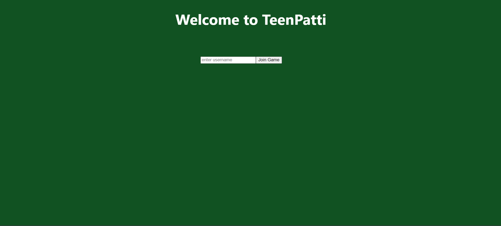
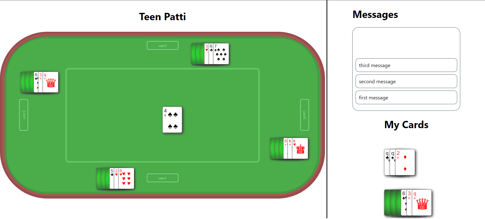

# TeenPatti Project

## Project Details

The **TeenPatti** project is a card game developed as part of a Computer Science 300 course using React and Socket.IO for real-time communication. TeenPatti, often referred to as "Indian Poker," is a three-card gambling game widely popular in South Asia. This project serves as an implementation of the game, incorporating key features like player registration, card shuffling, and betting.

The repository is organized into front-end and back-end components:

- **Front-end:** Built using React with TypeScript, styled with CSS.
- **Back-end:** Handled server-side logic for the game using Socket.IO and potentially Node.js.

### Key Features

- Real-time multiplayer gameplay using **Socket.IO** for communication between players and the server.
- Game states managed through React components
- Real-time updates and dynamic interactions using JavaScript/TypeScript
- User-friendly interface with game rules and betting logic integrated

## Goals

- Provide an academic submission for a CS300 course while demonstrating skills in full-stack development.
- Create a functional, interactive, and real-time TeenPatti game for multiple players.
- Utilize modern JavaScript technologies like React and TypeScript for front-end development.
- Implement real-time socket communication using **Socket.IO**.
- Experiment with game logic and real-time state management within a web application.

## Screenshots of the Application

  
_Login page where users can enter their username to join the game._

  
_Game page where all players are displayed at the table. Players can view messages, their cards, and the chips available._

## Steps to Run the Project:

1. Clone the repository to your local machine:
   `git clone https://github.com/naumanijazch/TeenPatti.git `
2. Navigate to project directory:
   `cd TeenPatti`
3. Frontend:
   - Navigate to frontend directory: `cd frontend`
   - Install the necessary dependencies: `npm install`
   - Start the development server: `npm start`
4. Backend:
   - Navigate to backend directory: `cd backend`
   - Start the backend server: `ts-node server.ts`
